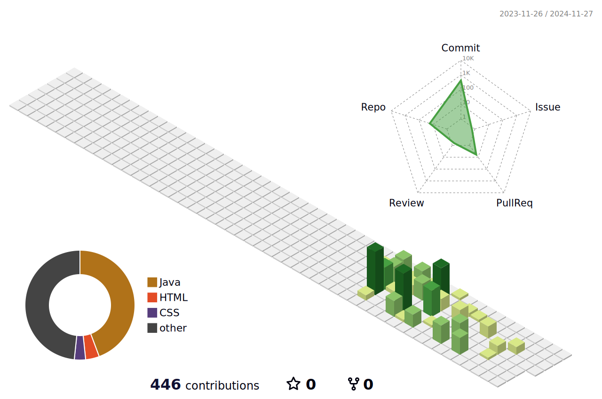

<!-- 헤더 섹션: 웨이브 디자인 적용 -->

  

<!-- 기술 스택 섹션 -->
<h3 align="center">📚 Tech Stack 📚</h3>

  &nbsp;
  &nbsp;
  &nbsp;
   
  &nbsp;
  &nbsp; 
  &nbsp; 
   
  &nbsp;
  &nbsp;
  &nbsp;
  &nbsp;
  &nbsp;
   
  &nbsp;
  &nbsp;
  &nbsp;
  &nbsp;
   
  &nbsp;
  &nbsp;
   
  &nbsp;

<!-- 팔로우 섹션 -->
<h3 align="center">🌈 Follow Me 🌈</h3>

  &nbsp;
  &nbsp;
  

<!-- 방문자 수 섹션 -->
<h3 align="center">👨‍💻 Visitors 👩‍💻</h3>

  

<!-- GitHub 통계 섹션 -->
<!--div align="center">
  
  

  

<!-- 기여도 그래프 섹션 -->
<!--div align="center" style="background-color:#0d1117; padding:20px; border-radius:10px;">
  

<!-- 활동 그래프 섹션 -->

  

<!-- 푸터 섹션: 웨이브 디자인 적용 -->

  

<!--  -->
